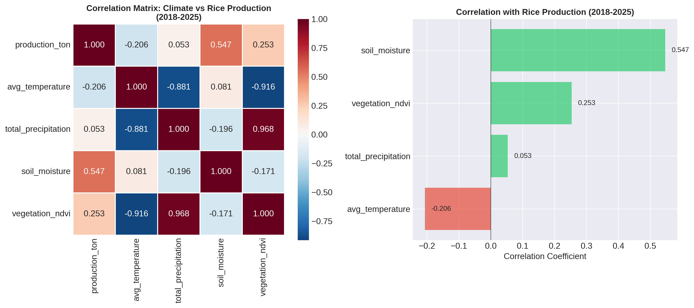

# East Java Rice PRoduction analysis (2018-2025)) & El Nino Impact Forecast 2026

## Deskripsi
Repository ini berisi analisis lengkap produksi padi di Jawa Timur menggunakan data klimatologi dan produksi padi dari tahun 2018 hingga 2025, serta prediksi dampak El Nino terhadap produksi padi tahun 2026 berdasarkan update BMKG 11 Juni 2026.

## Data Sources
| Sumber | Data | Periode |
|---------|------|---------|
|BPS Jawa Timur| Produksi padi tahunan dan bulanan| 2018-2025 |
|JASMAI| Data iklim harian (7 variabel) | 2003-2026 |
| BMKG | Climate Outlook & Update Dasarian I Juni 2026 | 2026|

## Methods
- **Pearson Correlation**: Hubungan iklim vs produksi
- **Ensemble Machine Learning**: Random Forest, Gradient Boosting, Ridge (prediksi 2026)
- **Stress Tolreance Index (STI)**: Ketahanan kekeringan kabupaten/kota (Fernandex, 1992)
- **Principal Component Analysis (PCA)**: Anilisis ketahanan alternatif
- **K-Means Clustering**: Pengelompokan kabupaten/kota

## Output Files
| No | Nama File | Deskripsi |
|----|------|------------|
|1| `1_correlation_analysis.png` | Heatmap korelasi + bar chart |
|2| `2_production_forecast_2026_bmkg_update.png` | Prediksi 3 skenario El Nino |
|3| `3_analisis_ketahanan_sti.png` | Dashboard STI (4 subplot) |
|4| `peringkat_ketahanan_sti.csv` | Peringkat ketahanan STI |
|5| `4_seasonal_patterns.png` | Pola produksi bulanan | 
|6| `5_complete_dashboard.png` | 9 subplot prediksi produksi padi |
|7| `Rice_Analysis_Results.xlsx` | Output excel berisi hasil analisis data |
|8| `6_2026_climate_forecast_comparison.png` | Perbandingan iklim 2026 vs historis|
|9| `Rice_Analysis_Results` | Hasil perhitungan analisis |

## Requirements
- Python 3.8+
- pandas, numpy, matplotlib, seaborn, scikit-learn, openpyxl

## How to Run
1. Clone reposity
2. Upload folder to Google Colab or run locally
3. Run cells sequentially from top to bottom
4. All outputs will be saved in folder `Hasil Analisis`

## Citation
If you use this analysis, please cite :
```
Ilmi, Kharisma C. 2026. East Java Rice Production analysis 2018 - 2025 and El Nino Impact to Forecast 2026. 
```

## Last update
15 Juni 2026

---

## Executive Summary
Hasil analisis prodksi pada Jawa Timur periode 2018 - 2025 menunjukkan faktor iklim yang paling berpengaruh terhadap peroduksi pada dengan nilai korelasi +0.547 (sedang-kuat). Produksi tertinggi tercatat pada tahun 2025 setahun setelah el Nino 2024 dengan total 20.53 juta ton, sementara hasil produksi terendah pada tahun 2024 dengan nilai total produsksi 9.24 juta ton akibat dampak dari El Nino yang terjadi di tahun tersebut.

Berdasarkan update BMKG 11 Juni 2026 el Nino Moderat (100% peluang) diprediksi terjadi pada semester II 2026 dan berdasarkan hasil analisis Stress Tolerance Index pada produksi padi di Jawa Timur ini akan berotensi menyebabkan penurunan produksi padi ke kisaran 9,6 - 9,8 juta ton.

## Korelasi Iklim dan Produksi

#### Hasil Korelasi Pearson (2018-2025)

| Variabel | Korelasi | Kekuatan | Arah | Interpretasi |
|----------|----------|----------|------|--------------|
| **Soil Moisture** | **+0.547** | Sedang | Positif | ✅ Paling berpengaruh |
| Vegetation NDVI | +0.253 | Lemah | Positif | ✅ Berpengaruh kecil |
| Temperature | -0.206 | Lemah | Negatif | ❌ Sedikit menghambat |
| Precipitation | +0.053 | Sangat Lemah | Positif | ⚪ Hampir tidak berpengaruh |

> **Kesimpulan:** Kelembaban tanah adalah faktor terpenting untuk produksi padi di Jawa Timur. Curah hujan tahunan tidak berkorelasi kuat karena **distribusi hujan** lebih penting daripada total tahunan.

#### Visualisasi Korelasi

*Gambar 1: Heatmap dan bar chart korelasi variabel iklim vs produksi padi*

## Tren Produksi Padi (2018 - 2025)

#### Data Produksi Tahunan

| Tahun | Produksi (juta ton) | Fenomena | Perubahan |
|-------|---------------------|----------|-----------|
| 2018 | 10.20 | Normal | - |
| 2019 | 9.58 | El Nino | -6.1% |
| 2020 | 9.94 | Normal | +3.8% |
| 2021 | 9.79 | La Niña | -1.5% |
| 2022 | 9.53 | La Niña | -2.7% |
| 2023 | 9.71 | Normal | +1.9% |
| **2024** | **9.27** | El Nino | **-4.5%**  |
| **2025** | **10.53** | Normal | **+13.6%**  |

> **Kesimpulan:** 
> - **2024** terjadi El Nino yang menyebabkan produksi terendah → 9.27 juta ton
> - **2025** masa pemulihan dari El Nino dan hasil produsk tertinggi → 10.53 juta ton
> - **El Nino** menurunkan produksi hingga **-4.5%**

## Pola Musiman Produksi Padi

#### Rata-rata Produksi Bulanan (2020-2024)

| Bulan | Produksi (juta ton) | Musim |
|-------|---------------------|-------|
| Januari | 0.28 | Rendah |
| Februari | 0.50 | Rendah |
| **Maret** | **1.70** | **Puncak**  |
| **April** | **1.60** | **Puncak**  |
| Mei | 0.80 | Menengah |
| Juni | 0.75 | Menengah |
| Juli | 1.00 | Menengah |
| Agustus | 0.80 | Menengah |
| September | 0.55 | Rendah |
| Oktober | 0.55 | Rendah |
| November | 0.55 | Rendah |
| Desember | 0.35 | Rendah |

> **Kesimpulan:**
> - **Puncak panen:** Maret-April (musim hujan)
> - **Produksi terendah:** Januari (akhir musim kemarau)
> - Pola ini konsisten setiap tahun


